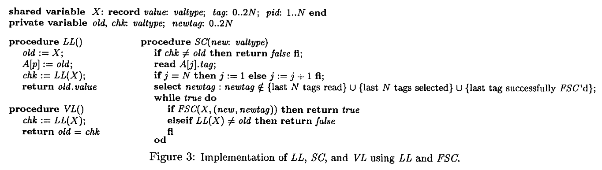

# The Anderson-Moir Algorithm for Single-Word Load-Link/Store-Conditional

In this blog post we look at an interesting algorithm from James H. Anderson and Mark Moir (https://dl.acm.org/doi/pdf/10.1145/224964.224985, Fig. 3)
that implements non-faulty load-link/store-conditional from a faulty version.
It is one of the simplest wait-free concurrent algorithms, yet it is already challenging enough to understand and verify.
The paper additionally presents a much more complex algorithm that implements multi-word Compare-and-Swap (CAS) from single-word primitives.
We will not study that algorithm here.

## Background

Load-Link and Store-Conditional (LL/SC) are a pair of atomic memory operations found in certain CPU instruction sets (e.g. ARMv7, ARMv8, RISC-V).
In some instruction sets (e.g. ARMv8.0) they are the only atomic operations available beside atomic load and store.
A well-known result in concurrency theory states that LL/SC has an infinite consensus number,
meaning it is theoretically possible to implement every other kind of atomic primitive using LL/SC.
However, LL/SC has more complex semantics than other common atomic primitives like Compare-and-Swap (CAS) or Fetch-and-Add (FAA),
and is difficult to use in practice.
Moreover, as we will explain later, almost every hardware implementation of LL/SC suffers from spurious failures, which must be taken into account when reasoning about programs using these instructions.
These factors make LL/SC an interesting target for formal verification.

The basic idea of LL/SC is as follows.
Suppose we have a register `R` that can be read and written.
When a thread `p` calls `LL()` on `R`, it obtains the latest value of `R`.
Furthermore, the system marks the version read by `p` as being "exclusive" to `p`.
Later, thread `p` may call `SC(x)` to write `x` into `R`.
The write will succeed only if the version exclusive to `p` is still the latest version, i.e. no write to `R` has occurred since `p` called `LL()`.

In hardware, LL/SC is usually implemented through a cache-coherence protocol.
When `p` calls `LL()` to read register `R`, the CPU marks the cache line containing `R` as being exclusive to `p`.
When other threads attempt to write to `R`, they may preempt `p`'s exclusive access to the cache line.
When `p` calls `SC(x)` later, the instruction succeeds only if `p`'s exclusive access has not been preempted.

At hardware level, there are many reasons a cache line might be evicted or preempted.
As such, when `SC(x)` fails it does not necessarily mean a write to `R` has occurred since the `LL()` call.
Such scenarios are called "spurious failures."
Possible reasons include:
1. `p` is holding the exclusive access for too long.
Normally, there should be only a few CPU instructions between `LL()` and `SC(x)`.
2. False sharing: If two memory locations share a single cache-line, then writing to one location will invalidate caches of the other location, causing `SC(x)` to fail.
3. Many LL/SC implementations do not allow making additional memory operations between `LL()` and `SC(x)`.
Nor can a thread hold exclusive access to multiple memory locations simultaneously.
Making such operations may cause `SC(x)` to fail.
4. Interrupts between `LL()` and `SC(x)`.

As such, most CPU documentations contain complex guidelines regarding the use of LL/SC.
See, for example, the ARMv8 reference section B2.17.2 [Exclusive access instructions and Shareable memory regions](https://developer.arm.com/documentation/ddi0403/d/Application-Level-Architecture/ARM-Architecture-Memory-Model/Synchronization-and-semaphores/Exclusive-access-instructions-and-Shareable-memory-regions?lang=en).

Note that while `SC(x)` can fail spuriously, it should never succeed spuriously.
Such scenarios should be considered CPU bugs.
The [errata notice](https://developer.arm.com/documentation/epm048406/latest/) for Cortex-A53 contains a bug of this kind but states it has never been observed to happen in practice.

## LL/SC without spurious failures

In this blog post, we look at one of the simplest LL/SC-based wait-free algorithms.
It takes a *faulty* (i.e. with spurious failures) LL/SC primitive and implements a *perfect* LL/SC primitive (i.e. without spurious failures).
The algorithm is shown in Fig. 3 of https://dl.acm.org/doi/pdf/10.1145/224964.224985 and reproduced below:


To understand this algorithm, we first consider a naive way to implement perfect LL/SC.
We attach a "version number" to each value written to `R`.
The initial value of `R` has version number `0`.
When a thread calls `LL()` it obtains both the value and the version number.
When the same thread calls `SC(x)`, it increases the version number by 1.
If `SC(x)` fails, it calls `LL()` again to get the latest version number.
If the version number remains the same, we know that the previous failure is spurious.
Otherwise, we can infer that a genuine memory write has occurred since the `LL()` call.

The issue with the above idea is that it requires an infinite space for version numbers, which is impossible in practice.
The idea of Anderson-Moir is to replace this "version number" with a finite set of labels.
Each label has two parts: a tag number (chosen by the thread making the `SC(x)` call) and a thread ID (ID of the thread making the `SC(x)` call).

Since labels can now be reused, when a thread reads two identical labels, it cannot always infer that they represent the same version.
Anderson-Moir resolves this issue by letting each thread write the tag it has read into an array `A`.
When a thread sees that a tag `t` has been written into `A`, it should not use the tag `t` when writing new versions into `R`.

Now we cannot enforce that as soon as thread `p` writes tag `t` into `A`, all other threads will see `t` and avoid using it.
In particular, another thread might have already picked the same tag for a new version and written that value into `R`.
However, if we know that a thread `p` has read the entire array `A` at least once *after* we have written `t` into `A`,
then we can be sure that `p` will not reuse `t`.
Anderson-Moir exploits this fact by coupling `SC(x)` calls with reads to `A`.

Specifically: When thread `p` calls `LL()`, it first reads `R` and obtains the value `x`, tag `t`, and thread ID `q`.
It writes the tag `t` into `A`.
Then it performs a second read on `R`.
There are two possibilities:
1. We observe a different tag or thread ID.
In this case at least one write has occurred since the version we just read.
In this case we can linearlize `LL()` on the first read, and make the subsequent `SC(x)` operation simply fail.
2. We observe the same tag `t` and thread ID `q`.
Note that this does not necessarily mean we have observed the same version as the first read.
It can be a later version that reuses the same tag.
In this case we linearize `LL()` on the second read,
and we say that thread `p` is currently "locked" on the label `(t, q)`.
As we will explain next, we can ensure that versions later than the second read will not reuse the same label.

When a thread `p` calls `SC(x)`, it needs to pick a tag for the new version.
For the moment, let us suppose that we can obtain an atomic snapshot of the entire array `A`.
Suppose that at the point where `x` is atomically written into `R`, some other thread `q` is locked on a label `(t, p)`.
Then there are two possibilities:
1. `t` is written into `A` before `p` takes the atomic snapshot of `A`.
In this case `t` must be contained in the snapshot.
2. `t` is written into `A` after `p` takes the snapshot.
In this case, since the second read by `q` must return the latest version of `R`,
`t` must be the tag used by `p` for the immediately previous version.

It follows that if we pick a tag `t'` that is different from any tag `t` in the snapshot of `A`,
and different from the tag `t` used in the immediately previous successful `SC(x)` by the same thread,
then we can guarantee that the new label will be different from any label that any other thread currently locks on.
If there are at most `N` threads, then we need to avoid at most `N+1` tags.
Hence, it is sufficient to use a tag space with `N+2` tags.

Having picked the tag `t`, we invoke the underlying potentially-faulty SC operation.
There are two possibilities:
1. The SC operation succeeds. In this case we return "Success" to the caller.
2. The SC operation fails. In this case we read `R` again with `LL()`.
If we see the same label as the one we are locking on, then we can infer the previous failure is spurious, since no other thread should have reused the locked label.
We should retry the `SC(x)` operation.
If we see a different label then at least one write has occurred since our `LL()` operation, so we should return "Failure" to the caller.

In practice, we cannot take a complete snapshot of `A` atomically.
Anderson-Moir replaces this atomic snapshot with reading one element of `A` at a time.
When picking the tag `t'`, we should avoid reusing tags `t` used in the previous `N` successful writes,
since we need `N` reads to observe updates in the array.
This means we need a tag space of `2 * N + 1` elements.

## The ideal LL/SC functionality

We are now ready to describe how to formally model the Anderson-Moir algorithm.
We begin by specifying an ideal LL/SC functionality in `specs/LLSC.v`.
This is the functionality that we aim to implement.

The state variables of the LL/SC object is shown below.

```Coq
  Inductive LLSC_Cmd :=
  | Idle
  | LLWait (v : nat)
  | LLDone
  | SCWait (x : val_t)
  | SCDone (ret : bool).

  Record LLSC_State := {
    llsc_curr_ver : nat;
    llsc_curr_excl_ver : NatMap nat;
    llsc_val_hist : NatMap val_t;
    llsc_cmd : NatMap LLSC_Cmd;
  }.
```

`llsc_curr_ver` records the current version number,
which is the number of successful writes that have occurred
since the beginning.
Initially, we have `llsc_curr_ver = 0`.
We maintain a finite map `llsc_val_hist` which records the complete value history of the register.
The initial value of the register is stored in entry 0 of `llsc_val_hist`.
Each subsequent successful write increases `llsc_curr_ver` by 1, and stores the new value into a new entry of `llsc_val_hist`.

Each thread is identified by its ID, which is a number between 0 and `N-1`.
For each thread we record its current status with a finite map `llsc_cmd`.
The possible statuses of each thread are enumerated in `LLSC_Cmd`.
Initially each thread is in `Idle` state which means it is not interacting with the object.
When a thread calls `LL()` we place it into `LLWait v` state where `v` is the latest version number at the point the thread initiates the call.
`LL()` is allowed to return the value of any version later or equal to `v`.

When `LL()` returns the state of the thread is `LLDone`, and the version it obtains is written into `llsc_curr_excl_ver`.
When a thread is in `LLDone` state, it can either call `CL()` to clear its exclusive access, or call `SC(x)` to initiate a conditional store.
In the former case we simply return to the `Idle` state.
In the latter case we enter the `SCWait x` state, which can transition to either `SCDone true` (signalling a successful write) or `SCDone false` (signalling that the exclusive version is not the latest version).

Since this is an ideal model without spurious failures, we require that to enter the `SCDone false` state we must have `llsc_curr_ver > llsc_curr_excl_ver[nid]` where `nid` is the thread ID.

## The faulty LL/SC functionality

We also need a formal model of the real LL/SC functionality which contains spurious failures.
This model is specified in `specs/FSC.v`.

```coq
  Inductive FSC_Cmd :=
  | Idle
  | LLWait (v : nat)
  | LLDone
  | SCWait (x : val_t) (t : tag_t)
  | SCDone (ret : bool).

  Record FSC_State := {
    fsc_curr_ver : nat;
    fsc_curr_excl_ver : NatMap nat;
    (* value, tag, and thread ID *)
    fsc_val_hist : NatMap (val_t * (tag_t * nat));
    fsc_cmd : NatMap FSC_Cmd;
    fsc_succ_count : NatMap nat;
    fsc_local_ver : NatMap nat;
  }.
```

It differs from `LLSC.v` in that the `SCWait x` state can always transition to the `SCDone false` state.
We still assume there are no spurious successes.

We need a few ghost variables for stating invariants of the algorithm.
We use a finite map `fsc_succ_count` to record the number of successful writes each thread has performed since the beginning.
We assume that the initial value of the register is written by thread 0.
Therefore, in the initial state `fsc_succ_count[0] = 1`, and `fsc_succ_count[nid] = 0` for all other threads.

For each version `v` written by thread `p`, we also record the number of successful writes by `p` *up to but excluding* `v`.
This is called the "local version number" of `v` and recorded in the finite map `fsc_local_ver`.
The initial version has local version 0, since it is the first write performed by thread 0.

## The Anderson-Moir algorithm and its invariants

The Anderson-Moir algorithm is formalized in `specs/Anderson.v`.

```coq
  Inductive Adrs_Phase :=
  | Idle
  | LLRead1
  | LLWriteTag (old_v : nat)
  | LLRead2 (old_v : nat)
  | LLDone (old_v : nat) (chk_v : nat)
  | SCStart (old_v : nat) (chk_v : nat) (x : val_t)
  | SCLLWait (chk_v : nat) (x : val_t)
  | SCLLDone (chk_v : nat) (ll_v : nat) (x : val_t)
  | SCSCWait (chk_v : nat) (ll_v : nat) (x : val_t) (t : tag_t)
  | SCReadTag.

  Record Adrs_State := {
    (* The FSC object state *)
    adrs_fsc : FSC.FSC_State;
    (* Phase of each process *)
    adrs_phase : NatMap Adrs_Phase;
    (* The locked-tag array A.
       When a process writes into A,
       we also make a copy of the
       succ_count array of FSC. *)
    adrs_lock_array : NatMap (tag_t * NatMap nat);
    (* Local view of the locked-tag array of each process,
       not explicitly named in the paper *)
    adrs_lock_view : NatMap (NatMap tag_t);
  }.
```

When a thread begins its `LL()` operation, it enters the `LLRead1` state (the first read).
The version number returned by this read is stored in `old_v`.
Of course the thread cannot see the version number, only the value of this version,
but we need to know the version number to prove correctness of the algorithm.

In the `LLWriteTag` state, the thread atomically writes the tag of version `old_v` into the array `adrs_lock_array`.
When this operation finishes, we also store a snapshot of the `fsc_succ_count` array.
Hence the type of each entry of `adrs_lock_array` is `tag_t * NatMap nat`.

Each thread `p` maintains a private array `adrs_lock_view[p]` which is its local view of the locked-tag array.
As explained above, during each iteration of `SC(x)` we read one element of `A`, so that after `N` iterations we should have performed a complete scan of `A`.

Now the key invariant of the Anderson-Moir algorithm is the following.
For a given thread `p`, suppose that `adrs_lock_array[p] = (t, C)`.
Note that `C` is the snapshot of the `succ_count` array when `p` writes `t` into the array.
If there exists a version `v` such that `tag(v) = t`, `nid(v) = q`, `local_ver(v) = lv` and `C[q] - 1 <= lv` (meaning either `v` is the latest version written by `q` when `p` writes `t` into `A`, or `v` is written by `q` after `p` writes `t` into `A`),
then for any version `v' > v` written by `q`, we have `tag(v') != tag(v)`.
Thus if `v` is the version that thread `p` currently locks on, then any later write by `q` will not reuse tag `t`.

To prove the key invariant, we need an invariant about the progress of each thread updating its local view of the locked-tag array.
If `adrs_lock_array[p] = (t, C)` and `C[q] = m`, then by the time `fsc_succ_count[q] >= m + N` we should have `adrs_lock_view[q][p] = t`.
To establish this property, we introduce a "read tag schedule" `S(m)`.
After a thread `p` successfully performs a write and increases its `succ_count` to `m`, it reads the entry `A[S(m)]`.
We assume that the schedule `S(m)` iterates over each thread in a round-robin fashion.

The formal proof roughly goes as follows.
Suppose that `local_ver(v') = lv'`. If `lv' <= lv + N - 1`, then since `q` should not reuse tags in the previous `N` successful writes, we have `tag(v') != tag(v)`.
If `lv' >= lv + N`, then by the read tag schedule, we should have `adrs_lock_view[q][p] = t`.
In this case thread `q` should avoid using tag `t` when making new writes.
Thus we also have `tag(v') != tag(v)`.

We prove a full refinement from `FSC + Anderson` to `LLSC` in `refine/Refine.v`.